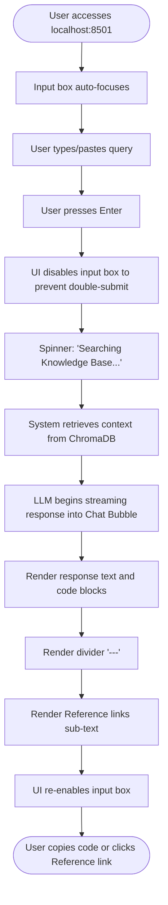
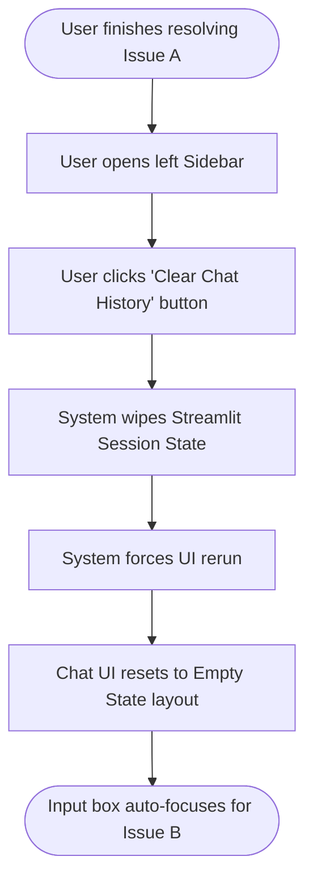

# UX Design Specification IntershopRAG

**Author:** Arun
**Date:** 2026-03-28

---

<!-- UX design content will be appended sequentially through collaborative workflow steps -->

## Executive Summary

### Project Vision

To transform a high-friction, login-gated documentation portal into an immediate, self-serve Q&A experience directly grounded in official documentation, keeping developers in their flow state with zero recurring API costs or data leakage.

### Target Users

- **Senior Backend Developers:** Need fast, highly specific technical lookups (e.g., API errors) with direct source citations.
- **Junior Engineers:** Need conceptual overviews and follow-up capabilities to understand proprietary architecture without tapping seniors on the shoulder.
- **DevOps/Admins:** Need CLI visibility into the async scraping pipeline's progress and error logs.

### Key Design Challenges

- **Trust via Citations:** Designing the UI to make source citations prominent and instantly verifiable so developers don't doubt the LLM's accuracy.
- **Developer Flow State:** Ensuring the Streamlit interface is minimal, fast, and keyboard-friendly, avoiding unnecessary clicks or visual clutter.
- **Context Retention:** Clearly displaying session history and context boundaries for follow-up questions without overwhelming the screen.

### Design Opportunities

- **Syntax Highlighting & Formatting:** Providing beautifully rendered code snippets and markdown tables instantly in the chat, far exceeding the readability of the standard KB.
- **Syntax Highlighting & Formatting:** Providing beautifully rendered code snippets and markdown tables instantly in the chat, far exceeding the readability of the standard KB.
- **Frictionless Onboarding:** Designing an empty state that educates junior engineers on *how* to best prompt the RAG system for architecture queries.

## Core User Experience

### Defining Experience

The primary, defining user interaction is querying the local AI about a specific Intershop technical issue and instantly receiving an accurate, markdown-formatted response complete with exact source citations. This core loop entirely replaces the high-friction "open browser, login via Microsoft Entra ID, search Knowledge Base, scan pages" workflow.

### Platform Strategy

- **Platform:** Browser-based web application (Streamlit).
- **Environment:** Desktop-first (developer workstations).
- **Constraints:** Must run entirely locally (Ollama + ChromaDB) to guarantee proprietary data privacy.

### Effortless Interactions

- **Keyboard-First Querying:** Submitting prompts seamlessly with the `Enter` key without touching the mouse.
- **One-Click Code Copy:** Accessible copy buttons for any code blocks or terminal commands generated in the response.
- **Session Continuity:** Auto-scrolling and seamless conversation history grouping so follow-up context is naturally retained.

### Critical Success Moments

- **The Verification Moment:** When the user clicks a citation link and sees the exact relevant section of the official Intershop Knowledge Base, confirming the AI's answer and instantly cementing developer trust.
- **The "Flow State" Rescue:** When a developer pastes an obscure `400 Bad Request` stack trace and the chat provides the exact correct payload fix within 5 seconds, allowing them to remain in their flow.

### Experience Principles

- **Accuracy Over Creativity:** The UX must visually emphasize the deterministic, verifiable nature of the RAG pipeline over open-ended "chatty" LLM interfaces.
- **Frictionless Entry:** Zero-login, zero-setup access for the primary developer persona. 
- **Transparent Sourcing:** Citations are not an afterthought; they are a primary, highly visible UI component.

## Desired Emotional Response

### Primary Emotional Goals

- **Empowered & Unblocked:** Users should feel immediate relief knowing they have a tool that instantly resolves their technical hurdles.
- **Deeply Trusting:** Because developers are naturally skeptical of LLM hallucinations, they must feel complete confidence that the answers are grounded in reality.

### Emotional Journey Mapping

- **Initial Entry:** The user is often focused, in a flow state, or slightly frustrated (e.g., facing a stack trace). The UI must feel calm and immediately ready for input.
- **During Query (Wait time):** Anticipation. The sub-5-second response time prevents the user from losing focus or switching tabs.
- **Upon Response:** Relief and clarity. The user finds the exact answer they need, structured beautifully.
- **Post-Verification:** Confidence. The user clicks a citation, sees the original source, and their trust in the tool increases.

### Micro-Emotions

- **Trust > Skepticism:** The primary emotional hurdle to overcome with AI coding tools.
- **Efficiency > Frustration:** Navigating away from the slow Microsoft Entra ID login portal to a fast local tool.
- **Clarity > Confusion:** Translating dense proprietary documentation into simple, highlighted answers.

### Design Implications

- **For Trust:** We must use distinct, prominent styling for "Sources" and "Citations." Citations shouldn't be hidden in footnotes; they should be proudly displayed as proof of work.
- **For Efficiency:** The UI should be "no-nonsense." A dark mode default to reduce eye strain, minimalistic layout, and no unnecessary splash screens or animations.
- **For Clarity:** Top-tier markdown rendering is required. Distinct visual separation between user queries, AI conceptual answers, code blocks, and source links.

### Emotional Design Principles

- **"Show Your Work":** The UI must aggressively prove its accuracy by surfacing sources before the user even has to ask.
- **"Stay Out of the Way":** The interface should act as an invisible, high-speed conduit to the technical answer, avoiding "chatty" or overly playful AI personas.

## UX Pattern Analysis & Inspiration

### Inspiring Products Analysis

- **Perplexity AI:** Solves the "hallucination problem" brilliantly. Their most innovative interaction is placing clear, clickable source "pills" at the top of the answer and embedding `[1]` numbered citations in-line. This builds immediate trust.
- **ChatGPT / Claude:** Excellent handling of chat history and code rendering. The distinct visual separation between the user's prompt and the AI's response, combined with clean markdown formatting and one-click "Copy Code" buttons.
- **Cursor IDE / Copilot:** Zero-fluff, keyboard-centric design that respects the developer's time.

### Transferable UX Patterns

**Navigation & Layout Patterns:**
- **Fixed Input Footer:** A standard, sticky input box at the bottom of the screen with an auto-scrolling chat history window above it.

**Interaction Patterns:**
- **Keyboard Shortcuts:** `Enter` to submit, `Shift+Enter` for a new line. 
- **Utility Buttons:** Hover-to-reveal "Copy Code" buttons on all markdown code blocks.

**Visual Patterns:**
- **Citation Badges:** Small, highly visible numbered pill badges (`[1]`, `[2]`) embedded directly in the text that link out to the scraped Knowledge Base sources.
- **Dark Mode Default:** Easing eye strain for developers working in IDEs.

### Anti-Patterns to Avoid

- **Hidden Sourcing:** Relegating citations to a tiny footnote at the bottom of a long response, forcing the user to hunt for verification.
- **Artificial Typing Delays:** Implementing slow, character-by-character "typing" animations that look cool but frustrate a developer who just wants to read the fast answer.
- **Cluttered Toolbars:** Adding too many settings, sliders, or prompt-tuning options. The tool should be single-purpose and instantly usable.

### Design Inspiration Strategy

**What to Adopt:**
- **Perplexity-style Citations:** We will adopt prominent, clickable source pills to ensure our primary emotional goal—trust—is constantly reinforced.
- **Standard Chat Dynamics:** Standard enter-to-submit and distinct User vs. AI message bubbles.

**What to Adapt:**
- **Streamlit Constraints:** We will adapt these chat patterns to fit smoothly within Streamlit's native `st.chat_message` components, keeping the implementation simple.

**What to Avoid:**
- **Slow Animations & Fluff:** Avoid any unnecessary visual flare that impedes reading the technical answer quickly. We are optimizing for unblocking the developer in under 5 seconds.

## Design System Foundation

### 1.1 Design System Choice

**Streamlit Native UI Framework (with CSS overrides)**

The design system will leverage the default component library provided natively by Streamlit, specifically utilizing `st.chat_message` and `st.chat_input` as the core building blocks.

### Rationale for Selection

- **Technical Alignment:** The PRD explicitly mandates Streamlit for the MVP Chat UI. Adopting a third-party design system (like Material UI or Chakra UI) conflicts directly with Streamlit's architecture.
- **Development Velocity:** Streamlit's native chat components provide a functional conversational interface out-of-the-box, allowing the single developer to focus completely on the complex backend RAG integration rather than frontend rendering.
- **Long-term Maintenance:** Sticking to native components ensures the UI won't break unpredictably when the framework updates.

### Implementation Approach

- Rely entirely on Python-driven UI generation.
- The interface will be built using standard layout containers (e.g., `st.container()`, `st.sidebar()`).
- High-quality, robust libraries will be used for markdown interpretation within chat bubbles to handle complex code blocks appropriately.

### Customization Strategy

- Customize the visual aesthetics primarily through Streamlit's built-in `.streamlit/config.toml` file to enforce a strict **Dark Mode** visual identity (resembling IDEs like VS Code). 
- Use minimal `st.markdown(css, unsafe_allow_html=True)` injections only where absolutely necessary to style our custom citation "pill" badges, ensuring they stand out visually without breaking the native DOM.

## 2. Core User Experience

### 2.1 Defining Experience

The defining experience is the **Local RAG Query Loop**: A developer enters a complex proprietary API error or architectural question into the chat, hits enter, and immediately receives a synthesized, accurate local answer that prominently cites the exact official Knowledge Base documentation. If we nail this interaction, it completely unblocks developers and eliminates the friction of discovering Intershop knowledge.

### 2.2 User Mental Model

Currently, users treat Intershop documentation as a "Search and Hunt" problem. When something breaks, they log into the portal, search a keyword, and scan through hundreds of lines of text across multiple tabs to find the specific snippet they need. 

Our defining experience shifts their mental model from *Searching* to *Direct Consulting*. They can enter their exact context (e.g., a stack trace) and the system acts as a senior engineer pointing directly to the fix.

### 2.3 Success Criteria

- **Time to First Token:** The AI must start streaming its response within 1-2 seconds, preventing the user from switching contexts.
- **Immediate Source Visibility:** Before the LLM even answers, the UI should indicate which specific Knowledge Base files were retrieved from ChromaDB. 
- **Zero-Friction Access:** The app must load instantly with the chat input automatically focused—no login walls, no splash screens.

### 2.4 Novel UX Patterns

While the chat interface (ChatGPT-style) is a well-established pattern, the strict local Retrieval-Augmented Generation approach requires a slightly different paradigm to build trust. We will use a "Sources First" visual pattern, identifying the extracted documentation pages prominently before or alongside the AI's synthesized text.

### 2.5 Experience Mechanics

**1. Initiation:**
- The user navigates to the local Streamlit port (`localhost:8501`).
- The UI loads a dark-themed empty state with quick-start prompt examples ("Explain ICM vs IOM", "How do I create a new Pipeline?").
- The chat input box is auto-focused.

**2. Interaction:**
- The user pastes their error log and hits the `Enter` key.
- The system immediately displays the user's message in a standard chat bubble.

**3. Feedback (The "Show Your Work" Phase):**
- A brief spinner/status message appears: "Searching local Knowledge Base..."
- The UI surfaces small metadata pills of the retrieved articles (e.g., `📄 Pipeline Concepts`, `📄 Error Handling Guide`).
- The LLM's answer begins streaming into a new chat bubble, utilizing markdown for formatting and syntactic highlighting.

**4. Completion:**
- Upon completion, hover-to-copy buttons activate for any parsed code blocks.
- The user can click any citation pill to open the original scraped markdown file or a link to the live portal.
- The input box regains focus, ready for follow-up context.

## Visual Design Foundation

### Color System

The application will enforce a strict **Dark Mode** default, heavily inspired by modern IDEs to minimize eye strain.

- **Background (Base):** Deep gray (`#0E1117` Streamlit's default dark mode, or `#1e1e1e` VS Code style).
- **Text (Primary):** Off-white (`#FAFAFA`) for high contrast readability.
- **Accent (Primary Action):** Muted IDE Blue (`#569CD6`) for links, citations, and primary buttons.
- **Citation Badges:** Subdued background (`#262730`) with a subtle border (`#4b4b4b`) and light text, ensuring they are visible but don't visually overwhelm the reading experience.
- **Code Block Backgrounds:** Pitch black (`#000000`) or very dark gray (`#151515`) to offset from the main UI.

### Typography System

- **Primary UI Font:** System sans-serif (`Inter`, `Segoe UI`, `Roboto`) to ensure fast local rendering without external requests.
- **Monospace Font:** Essential for developers. We will enforce a clean monospace font (`Fira Code`, `JetBrains Mono`, `Consolas`) for all code snippets, stack traces, and in-line technical terms (e.g., `PipelineNode`).
- **Hierarchy:** Minimal heading structures. The focus is entirely on the body text and code blocks. Line-height will be increased slightly (e.g., `1.6`) to improve readability of dense technical explanations.

### Spacing & Layout Foundation

- **Layout Structure:** Native Streamlit vertically constrained single-column layout. 
- **Sidebar Strategy:** The left sidebar will be kept out of the way, used only for secondary settings (e.g., "Select Local Model" or "Clear History"). 
- **Input Grounding:** The chat input remains permanently fixed to the bottom of the viewport, with ample padding (`24px`+) between the last chat bubble and the input to prevent claustrophobic text wrapping.

### Accessibility Considerations

- **Contrast Ratios:** Because we are using a dark theme, we will ensure all primary text meets WCAG AAA standards against the `#0E1117` background.
- **Focus States:** The chat input will feature a clearly visible focus ring when active, supporting keyboard-only navigation.

## Design Direction Decision

### Design Directions Explored

Four distinct design directions were evaluated, exploring variations in citation placement, visual minimalism, and context-rendering approaches:
1. **The "Perplexity Stack"**: Sources prominently listed at the top with inline numbered pills.
2. **The "Footnote Scholar"**: Clean text flow with a detailed references section at the bottom.
3. **The "Dynamic Sidebar Context"**: Expanding sidebar showing retrieved exact text alongside the chat.
4. **The "Terminal Hacker"**: Ultra-minimalist command-line aesthetic.

### Chosen Direction

**Direction 2: The "Footnote Scholar"**

### Design Rationale

This direction prioritizes an uninterrupted reading experience. Developers often need to quickly parse technical context, and avoiding inline `[1]`, `[2]` citation markers reduces visual clutter. By cleanly grouping the references at the base of the conversational bubble, the design honors the requirement for absolute verifiable accuracy without sacrificing scannability.

### Implementation Approach

- **Streamlit Mapping:** Utilize the native `st.chat_message("user")` and `st.chat_message("assistant")`.
- **Payload Construction:** The backend RAG response must be parsed to extract the generated answer first, followed by a markdown divider (`---`).
- **Citation Rendering:** The source documentation filenames and links will be injected below the divider using markdown sub-text styling (or `st.caption`) to visually differentiate the "References" section from the primary conversational output.

## User Journey Flows

### 1. The Troubleshooting Journey (Primary Flow)

This represents the core loop where a developer pastes an error or asks a specific question and receives a fully cited answer.

### 2. The Context Reset Journey

Developers frequently switch between completely different tickets or problems (e.g., pipeline errors vs. frontend REST API design). Context bleed from previous RAG messages can confuse the LLM. This flow ensures a clean slate.

### Journey Patterns

Across these flows, we establish strict interaction patterns:

- **State Lockout Pattern:** The text input must be disabled immediately upon submission and only re-enabled after the final citation has been dumped to the UI, explicitly preventing rapid-fire submissions that overload the local LLM.
- **Scroll Pinning Pattern:** As the LLM streams its response, the UI must automatically scroll the user to the bottom of the page, ensuring they always see the latest generated word.
- **Context Wiping Pattern:** A highly visible "clear state" button must exist to allow users to bypass the limitations of small local LLM context windows when switching topics.

### Flow Optimization Principles

- **Zero-Click Entry:** The application must utilize HTML/JS auto-focus (or Streamlit's native equivalent) so a developer can `Alt-Tab` to the browser and immediately `Ctrl-V` their stack trace.
- **Predictable Feedback:** The user must never wonder if the system stalled. If retrieval takes 3 seconds, a spinner MUST be visible during that gap.

## Component Strategy

### Design System Components

**Available from Streamlit Native:**
- `st.chat_message`: The core conversational wrapper.
- `st.chat_input`: The sticky input footer.
- `st.write_stream`: For real-time typing effect of the LLM output.
- `st.spinner`: For indicating the context retrieval phase.
- `st.sidebar`: For out-of-the-way settings and context management.

**Gap Analysis:**
Streamlit does not have native "Citation Pill" components or specific "Footnote/Source" UI wrappers designed expressly for RAG outputs. We must create logical custom components using Streamlit's robust markdown rendering engine.

### Custom Component Specifications

### 1. The Citation Footer
**Purpose:** Displays the exact knowledge base references used by the local LLM to prevent hallucination skepticism.
**Usage:** Rendered within the assistant's `st.chat_message` block immediately after the generated text completes.
**Anatomy:** 
- A visual separator (Markdown `---`).
- Sub-text styling (HTML ``).
- A bulleted list of markdown links pointing to the scraped KB markdown files or portal URLs.
**Accessibility:** Ensures link texts are descriptive (e.g., "Pipeline Concepts" rather than "Click Here").
**Interaction Behavior:** Links open in a new browser tab (`target="_blank"`) to preserve the chat state.

### Component Implementation Strategy

- **Foundation-First:** We will not build custom frontend React components. All UI elements must be achievable via Streamlit's Python API (`st.*`).
- **Markdown as a Component:** For our custom Citation Footer, we will write a Python helper function that takes a list of ChromaDB source metadata and formats it into a highly stylized markdown payload, which is then passed to `st.markdown(..., unsafe_allow_html=True)`.

### Implementation Roadmap

**Phase 1 - Core Interaction (MVP):**
- Setup `st.chat_input` and basic Session State management.
- Implement strictly native `st.chat_message` loops.

**Phase 2 - The Verification Layer:**
- Implement the `st.spinner` for the "Searching Knowledge Base" phase constraint.
- Build the Python helper that injects the **Citation Footer** markdown string below the LLM response.

**Phase 3 - Context Management:**
- Implement the `st.sidebar` layout.
- Add the "Clear History" button to manage token context windows.

## UX Consistency Patterns

### Feedback Patterns (Loading & Retrieval)

**When to Use:** During the gap between the user hitting "Enter" and the LLM starting to stream tokens.
**Visual Design:** Utilize Streamlit's native `st.spinner()`.
**Behavior:** The text should be specific to the current backend action to build trust. Instead of a generic "Loading...", use "Querying ChromaDB for relevant articles..." or "Initializing local Ollama model...". The spinner must disappear exactly when the first token streams.

### Error Recovery Patterns

**When to Use:** When the local architecture fails (e.g., Ollama is not running, ChromaDB is missing data, or the prompt returns zero context matches).
**Visual Design:** Native `st.error()` boundary or a specifically styled AI chat bubble with a red warning icon.
**Behavior:** Never fail silently. If the backend fails, the UI must explain *why* and *how to fix it*, since the user is a developer. 
*Example:* "Error: Could not connect to Ollama on port 11434. Please ensure the Ollama daemon is running locally."

### Empty State Patterns

**When to Use:** On initial page load or immediately after the user clicks "Clear Chat History."
**Visual Design:** A visually distinct centered block containing brief onboarding text and 2-3 "Example Prompts."
**Behavior:** If the user clicks an example prompt, it should automatically populate the chat input box or submit the query instantly. This overcomes the "blank page syndrome" and educates junior developers on the types of questions the RAG system excels at.

### Button Hierarchy

**When to Use:** For secondary actions outside the core chat loop (e.g., clearing context, toggling settings).
**Visual Design:** Secondary buttons should live exclusively in the left `st.sidebar` to keep the main chat area completely focused on the conversation.
**Behavior:** Buttons like "Clear History" should span the full width of the sidebar and trigger an immediate `st.rerun()` to visually clear the screen in one fluid motion.

## Responsive Design & Accessibility

### Responsive Strategy

**Desktop-First Approach:**
IntershopRAG is primarily an accompanying tool for developers sitting at large monitors or multi-monitor setups. 
- The chat layout will comfortably stretch to a max-width (e.g., `800px`) to prevent lines of text from becoming too long to read easily.
- Wide code blocks must utilize horizontal scrolling (`overflow-x: auto`) rather than breaking lines, to preserve code formatting and indentation.

**Tablet / Mobile Strategy:**
- Streamlit's native responsive engine will automatically collapse the left sidebar into a hamburger menu on narrower viewports.
- The chat input will remain fixed to the bottom of the viewport universally.

### Breakpoint Strategy

We will rely on Streamlit's robust internal breakpoints:
- **Mobile/Tablet (< 992px):** Sidebar is hidden behind a toggle. Main content area takes 100% width.
- **Desktop (>= 992px):** Sidebar is persistently visible (if triggered). Main content is centered with a comfortable reading maximum width.

### Accessibility Strategy

We aim for **WCAG 2.1 Level AA** compliance.

- **Color Contrast:** The dark mode theme enforces an absolute minimum of 4.5:1 contrast ratio, but targets AAA (7:1) for all primary body text (`#FAFAFA` on `#0E1117`).
- **Syntax Highlighting Contrast:** Special care must be taken to ensure the syntax highlighting theme used in code blocks maintains high contrast (avoiding dark blues on black backgrounds).
- **Keyboard Navigation:** The chat input must auto-focus on page load. All interactive elements (copy buttons, citation links) must be reachable via standard `Tab` navigation.

### Implementation Guidelines

- **Native Reflows:** Developers should avoid hardcoding pixel widths in Python layout containers (e.g., avoid `width=500` inside column definitions) and instead use Streamlit's relative column weighting (e.g., `st.columns([1, 3])`).
- **Semantic Markdown:** Ensure the RAG pipeline generates clean, semantic markdown (using actual `##` headers and `` code fences) so screen readers can parse the structure logically.
